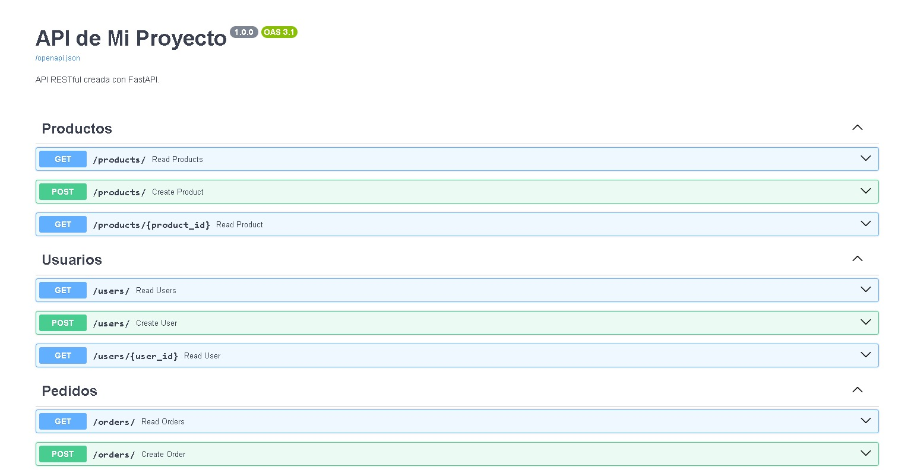

# Backend Tienda Online - FastAPI

Este proyecto es un servicio Backend RESTful desarrollado con **FastAPI** como parte de la estrategia de desacoplamiento del sistema monolítico. Provee endpoints para la gestión de productos, usuarios y pedidos.

## Tecnologías
*   Python 3.12+
*   FastAPI
*   Uvicorn
*   Pydantic

## Documentación de la API (Swagger UI)

A continuación se muestra la evidencia de los endpoints implementados y funcionales:



## Instalación y Ejecución

1.  **Clonar el repositorio:**
    ```bash
    git clone <URL_DEL_REPO>
    cd fastapi-project
    ```

2.  **Crear entorno virtual e instalar dependencias:**
    ```bash

    python -m venv venv

    .\venv\Scripts\activate

    pip install -r requirements.txt

    ```

3.  **Ejecutar el servidor:**
    ```bash

    uvicorn app.main:app --reload
    
    ```

4.  **Acceder a la documentación:**
    Abre tu navegador en `http://127.0.0.1:8000/docs`.